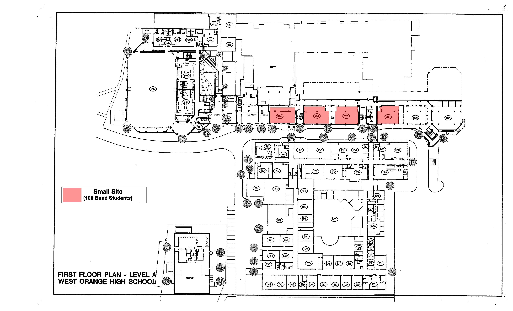
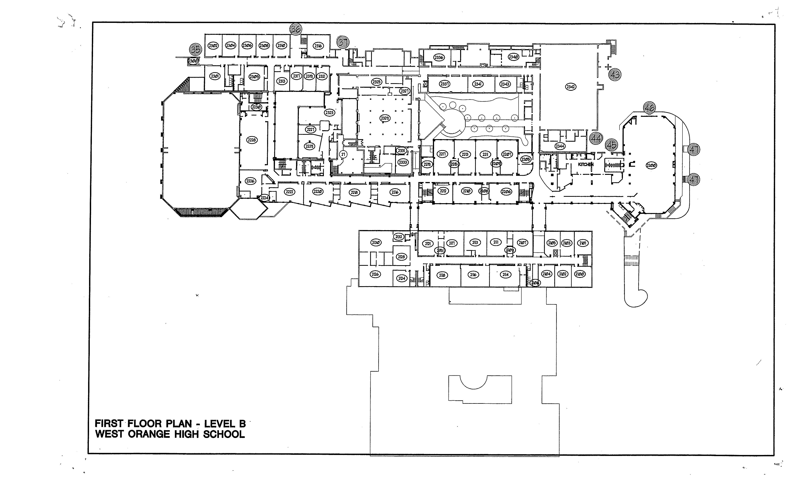

#Initial Testing
##Blah
###Blah
####Blah
#####Blah
######Blah
Blah
Blah and then I did this!
Really surprising ain't it?  
Well what if I tried this?  
Quite a bit better.
Well let's try to actually start this now.

#Independent Study
Breif Overview of Independent Study  
For my senior year of highscool I took an independent study, which basically means to do / learn something that the school doesn't offer under a teacher who can help and moniter you as you go about completing your independent study.  
I decided to create an interactive map of the West Orange High School campus with the intention of allowing students, faculty, and vistors of navigating our fairly large a somewhat unintuitively laid out buildings. I was inspired to do this as my project after I had to help my Mom find a room (I believe it was guidance) over the phone for at least the third time.
  
##Contents
1. The Initial Plan
2. Measuring The Campus
3. Change Of Plans
4. Pulling The Rug Out
5. In The End
  
##The Initial Plan
When I started this project 
  
##Measuring The Campus
Blah
  
  
  
*The maps of the first two floors as they were given after being turned into a JPG from a PDF*  
  
*The maps of the first two floor after I removed what I could with 5 minutes of understanding in adobe photoshop*

After I got the floor plans modified to as useful as I could and turned into a file format that AutoCad would accept, I brought them into AutoCad and began 
  
##Change Of Plans
Growing increasingly frustrated with the second floor's refusal to cooperate as well as a lengthening lack of a response as to when I would be able to get Android Studio on the architecture room's computers, I decided I would put the second floor on hold and begin measuring the third and fourth floors.
  
Might wanna move this later: It was important that I get Android Studio on Mrs. Celi's computers because I kinda needed it to do the whole you know, app making part of the project. However the response that Mrs. Celi got when she asked whoever to get it on her computers was that they would not be installing it because it did not relate to her class. The problem with that logic is that there were only two other places I knew would be able to get it, Computer Science with Mr. Leach, and Engineering with Mrs. Gardner. And while Mr. Leach already had a downloaded version of Andriod Studio installed, it had been removed a couple years ago because the Computer Science room was using some of the oldest computers in the building and couldn't run it. Mrs. Gardner I knew already had a class during my independent study period and was using a different, more educationally focused version of Android Studio than I needed so I couldn't work there either. 
  
At this point I decided to go find Mr. DelGurcio and ask if he could get me Android Studio specifically for my independent study. Imagine my surprise then when just as I'm crossing the bridge to go to his office, I see him in the hallway walking towards me, saying that he wanted to talk to me. Now having a dean seek you out is never going to be a suspense free moment but I figured Mr. DelGurcio had an update on the idea for using wifi to help people navigate around.
  
##Pulling The Rug Out
Blah
  
##In The End
Blah

## 